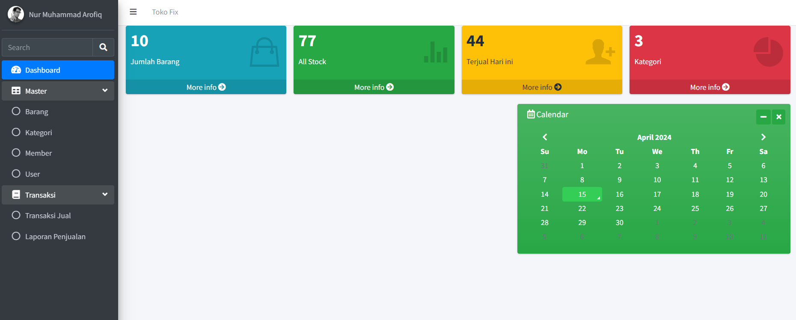
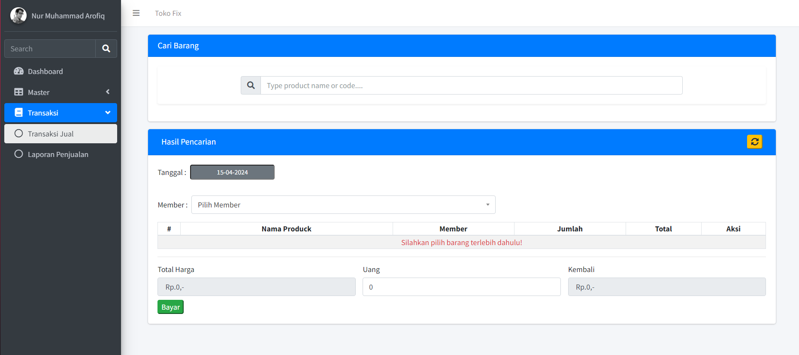
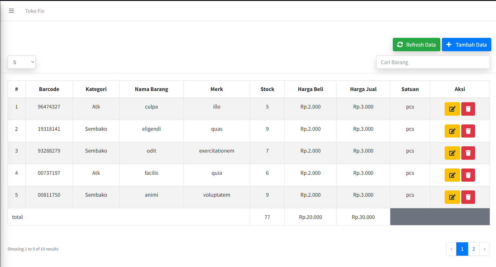

> **Important Note:** This Project is ready for Production. But use code from main branch only. If you find any bug or have any suggestion please create an Issue.

# Local Installation

- run `` https://github.com/Fiqsss/fiqsss-pos.git ``
- run ``composer install ``
- copy .env.example to .env
- run `` php artisan key:generate ``
- set up your database in the .env
- run `` php artisan migrate --seed ``
- run `` php artisan storage:link ``
- run `` php artisan serve ``
- then visit `` http://localhost:8000 or http://127.0.0.1:8000 ``.

## Demo

**Live Demo:** will update soon

## Fiqsss POS Features

- **Products Management**
- **Kategori Management**
- **Member Management**
- **User Management**
- **Transaction Sale Management**
- **Reports**
